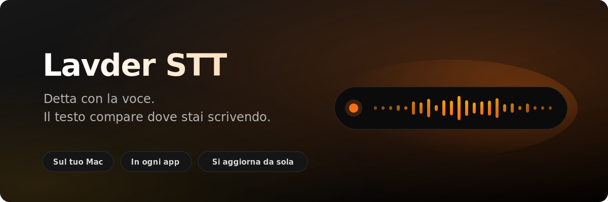

  

  
  
  
  
  

  

 

<table>
<tr>
<td width="150" align="center" valign="middle">
  
</td>
<td valign="middle">

### Detta ovunque, senza cambiare finestra

Tieni premuta una scorciatoia, parli, rilasci. Il testo compare **dove stavi già scrivendo**:
la mail, il messaggio, il campo di ricerca, l'editor di codice. Non c'è una finestra in cui
dettare e da cui poi copiare.

La trascrizione avviene **sul tuo Mac**. Niente account, niente abbonamento per iniziare.

</td>
</tr>
</table>

 

## Cosa sa fare

<table>
<tr><td width="56" align="center">🎙️</td><td><b>Dettatura globale</b> in qualunque app, con scorciatoia o tenendo premuto il mouse</td></tr>
<tr><td width="56" align="center">🧠</td><td><b>Correzione automatica</b> di punteggiatura e refusi con l'AI di sistema</td></tr>
<tr><td width="56" align="center">📖</td><td><b>Dizionario personale</b>: nomi, sigle e termini che vuoi vengano scritti giusti</td></tr>
<tr><td width="56" align="center">🔇</td><td><b>Microfono prioritario</b> e <b>audio abbassato</b> mentre detti, per non disturbare le chiamate</td></tr>
<tr><td width="56" align="center">📊</td><td><b>Statistiche</b> su parole dettate e tempo risparmiato</td></tr>
<tr><td width="56" align="center">⌨️</td><td><b>Modalità appunti</b> di riserva, se preferisci non dare l'accessibilità</td></tr>
</table>

 

## Installazione

1. Apri il file `.dmg` che hai scaricato
2. Trascina **LavderSTT** dentro **Applicazioni**
3. Aprila da Applicazioni o da Spotlight

L'app è firmata con un certificato Apple Developer ID e notarizzata da Apple: si apre senza
avvisi di sicurezza e senza dover autorizzare nulla a mano.

> [!NOTE]
> **Non ha icona nel Dock.** Lavder STT vive nella barra dei menu, in alto a destra: cerca
> l'icona del microfono. È normale che aprendola non "succeda niente" a schermo.

 

## Primo avvio: i permessi

Una breve guida ti accompagna al primo avvio. Le autorizzazioni **deve concederle l'utente di
persona**: macOS non permette a nessuna app, per quanto firmata, di autorizzarsi da sola.

| Permesso | A cosa serve | Come |
|---|---|---|
| **Microfono** | sentire quello che detti | avviso automatico, alla prima dettatura |
| **Riconoscimento vocale** | trasformare la voce in testo | avviso automatico, alla prima dettatura |
| **Accessibilità** | scrivere il testo nell'app in cui stai lavorando | manuale, vedi sotto |

**L'accessibilità è l'unico passaggio manuale.** Vai su *Impostazioni di Sistema → Privacy e
sicurezza → Accessibilità*, trova **LavderSTT** nell'elenco e attiva l'interruttore. La guida
introduttiva ha un pulsante che apre direttamente quel pannello.

> [!TIP]
> Senza accessibilità l'app funziona lo stesso: invece di inserire il testo te lo mette negli
> appunti, e lo incolli con ⌘V.

 

## Aggiornamenti

L'app **si aggiorna da sola**. Controlla una volta al giorno e ti propone la nuova versione
quando esce. Puoi forzare il controllo dal menu nella barra o dalle Impostazioni, e da lì
disattivarlo se preferisci decidere tu.

Non serve tornare su questa pagina né riscaricare il DMG a ogni versione.

 

## Requisiti

- macOS **26** o successivo
- Mac con **Apple Silicon** (M1 o superiore)

Su versioni precedenti di macOS l'app non si avvia: usa API di riconoscimento vocale e di
intelligenza artificiale che prima non esistevano.

 

## Privacy

La dettatura funziona **sul tuo Mac**: audio e testo non escono dal computer.

Fa eccezione una sola funzione facoltativa, spenta finché non l'accendi tu: il motore di
trascrizione OpenAI, che richiede una tua chiave API e manda l'audio ai loro server.

 

## Sicurezza degli aggiornamenti

Ogni disk image è firmata con una chiave crittografica di cui l'app conosce solo la metà
pubblica. Chi riuscisse a manomettere questa pagina o il feed non potrebbe comunque far
installare un programma diverso: l'app rifiuterebbe la firma.

 

---

  
    Questo repository contiene solo il canale di distribuzione — il feed degli aggiornamenti e
    le disk image firmate. Il codice sorgente è privato.
      
    Un progetto <a href="https://github.com/lavderenterprise"><b>Lavder Enterprise</b></a>
  

